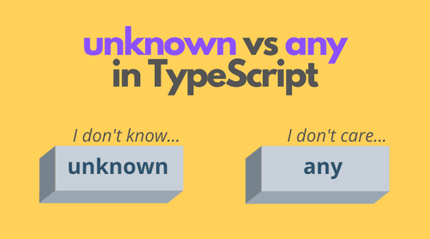

# Stop Using `any`, Here's Why `unknown` Is the Safer Choice in TypeScript

## Introduction

When you've been writing TypeScript for a while, and included `any` at least once. You were migrating JavaScript code and needed to "deal with it later." It felt like a quick fix. And it was - until it wasn't.

The thing `any`: doesn't just pause TypeScript's type checker. It shuts it down entirely. It's not a workaround - it's a hole in your safety net. TypeScript won't warn you when something falls through.

Let's break down exactly why `any` is dangerous, what `unknown` does differently, and how **type narrowing** gives you a clean, safe way to handle data you don't fully control.

---

## What's Wrong with `any`?

When you type something as `any`, you're essentially telling TypeScript: _"Trust me, I know what this is."_ The compiler backs off and lets you do whatever you want with the value - call methods on it, index into it, pass it anywhere. No questions asked.

```typescript
function processInput(input: any) {
  console.log(input.toUpperCase());
  // toUpperCase() is not available in number type but no error before run from typescript
}

processInput(42); // Runtime crash: input.toUpperCase is not a function
```

TypeScript saw no problem here. But your code is crashed at runtime.

_**This is the core issue:**_ `any` removes the type-checking entirely, not just for the variable itself, but for anything it touches. Once a value is `any`, it can silently infect the rest of your code.

```typescript
function getData(): any {
  return { name: "Uhai", age: 28 };
}

const user = getData();
const uppercased = user.name.toUpperCase(); // Fine
const broken = user.score.toFixed(2); // No error befor execution.
```

You get no error suggestion from the compiler.

---

## Enter `unknown`, The Alternative of `any`

`unknown` is TypeScript's way of saying: _**"I have a value, but I don't know its type yet and I'm not going to pretend I do."**_

`unknown` forces you to verify what you actually have before you use it. Try to call a method or access a property on an `unknown` value without checking first, and TypeScript will immediately complain.

```typescript
function processInput(input: unknown) {
  console.log(input.toUpperCase()); // Error: 'input' is of type 'unknown'.
}
processInput(42);
```

That error is a feature, not a bug. TypeScript is protecting you from writing code.

To use an `unknown` value, you have to **narrow its type** first. That's where type narrowing comes in.

---

## Type Narrowing

Type narrowing is the process of refining a broad or uncertain type into a more specific one using runtime checks. TypeScript watches your code and understands what type a variable must be inside a given block, based on the checks you write.

### 1. `typeof` Narrowing

The most common form. Works great for primitive types like strings, numbers, and booleans.

```typescript
function formatValue(value: unknown): string {
  if (typeof value === "string") {
    return value.toUpperCase(); // TypeScript knows it's a string here
  }
  if (typeof value === "number") {
    return value.toFixed(2); // TypeScript knows it's a number here
  }
  return String(value); // Fallback for anything else
}

formatValue("hello"); // "HELLO"
formatValue(3.14159); // "3.14"
formatValue(true); // "true"
```

Inside each `if` block, TypeScript has narrowed the type. You get full autocomplete and type safety.

### 2. `instanceof` Narrowing

Useful when you're working with class instances or built-in objects like `Date` or `Error`.

```typescript
function handleError(error: unknown): string {
  if (error instanceof Error) {
    return error.message; // TypeScript knows this is an Error object
  }
  return "An unexpected error occurred";
}
```

### 3. `truthiness` Narrowing

Prevents errors by checking if a value actually exists.

```typescript
function greet(name: string | null) {
  if (name) {
    return `Hello, ${name}!`; // name is a string
  }
  return "Hello, Guest!"; // name is null
}
```

### 4. `Equality` Narrowing

Checks if two variables are equal to narrow down their possible types.

```typescript
function compare(x: string | number, y: string | boolean) {
  if (x === y) {
    x.toUpperCase(); // x and y must both be strings to be equal
  }
}
```

### 5. The `in` Operator

Checks if an object contains a specific key.

```typescript
type Fish = { swim: () => void };
type Bird = { fly: () => void };

function move(animal: Fish | Bird) {
  if ("swim" in animal) {
    return animal.swim(); // animal is Fish
  }
  return animal.fly(); // animal is Bird
}
```

### 6. Discriminated Unions Narrowing

Uses a shared property (like kind or type) to tell types apart.

```typescript
interface Circle {
  kind: "circle";
  radius: number;
}
interface Square {
  kind: "square";
  side: number;
}

function getArea(shape: Circle | Square) {
  if (shape.kind === "circle") {
    return Math.PI * shape.radius ** 2;
  }
  return shape.side ** 2;
}
```

### 7. `is` (operator) User-Defined Narrowing

A custom function that returns a boolean to tell TypeScript what a type is.

```typescript
function isString(val: unknown): val is string {
  return typeof val === "string";
}

function process(input: unknown) {
  if (isString(input)) {
    console.log(input.length); // input is narrowed to string
  }
}
```

## Conclusion

`any` is TypeScript with the ignore type checking

`unknown`, paired with type narrowing, gives you the best of both.

The next time you're tempted to write `: any`, pause and ask yourself: _do I actually know what this is?_ If not, use `unknown` and narrow it down properly.

`narrowing` is the process of refining a value's type from a broader type to a more specific one based on runtime checks.

_**Sincerely**_
</br></br>
_author:_ **Uhai Mong** -Full stack web developer(MERN) </br>
_Published:_ **07 May, 2026 :** _01:00 AM_

**_Thank you_**
